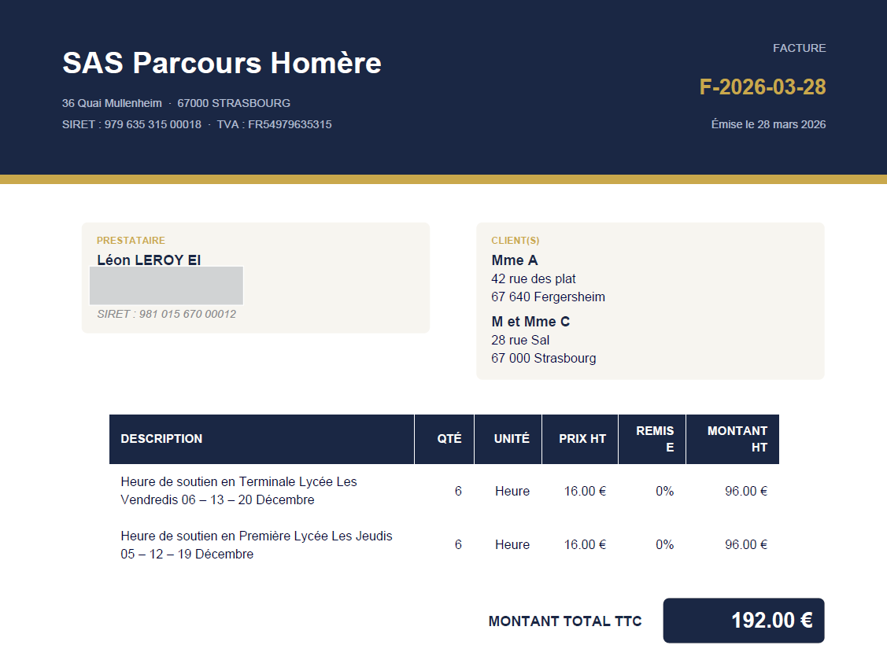
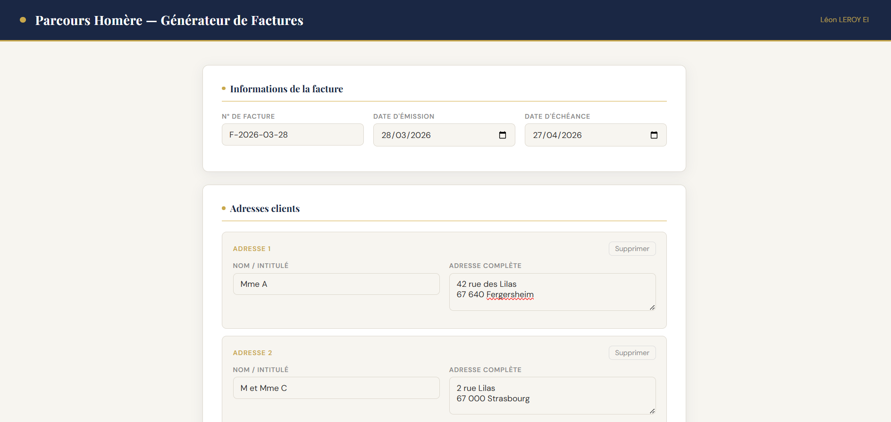
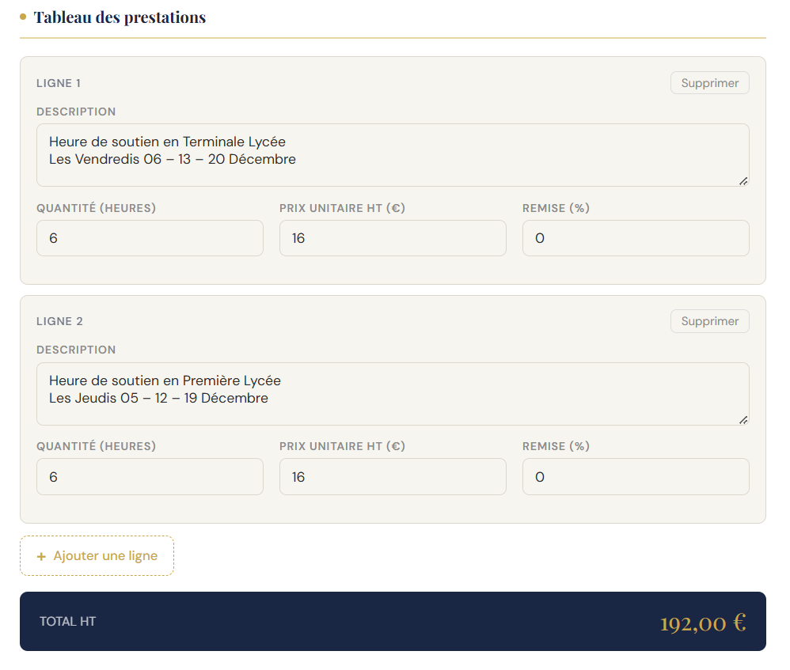

# 📄 Générateur de Factures — Parcours Homère

> Application de bureau pour générer des factures PDF professionnelles de tutorat, en quelques clics.



---

## ✨ Fonctionnalités

- 🗓️ **Date d'émission et d'échéance** configurables
- 👥 **Adresses clients dynamiques** — ajouter ou supprimer selon le mois
- 📊 **Tableau de prestations** — description libre, heures, prix, remise
- 💰 **Total calculé en temps réel** dans l'interface
- 📥 **Export PDF** d'un seul clic, prêt à envoyer
- 🖥️ **Fonctionne 100% en local** — aucune connexion internet requise

---

## 📸 Aperçu

### Interface de saisie
> L'application s'ouvre dans votre navigateur sur `localhost:8765`



### Exemple de facture générée



---

## 🚀 Installation & Lancement

### Prérequis

- [Python 3.10+](https://www.python.org/downloads/)
- La librairie `reportlab`

### 1. Cloner le dépôt

```bash
git clone https://github.com/leonleroy88/Application_Facture.git
cd Application_Facture
```

### 2. Installer la dépendance

```bash
pip install reportlab
```

### 3. Lancer l'application

#### ▶️ Option A — Double-clic (recommandé sur Windows)

Double-cliquez sur **`Lancer_Factures.bat`**  
→ Le navigateur s'ouvre automatiquement sur `http://localhost:8765`

> ⚠️ Ne fermez pas la fenêtre noire pendant l'utilisation — vous pouvez la minimiser.

#### ▶️ Option B — Terminal

```bash
python appvff.py
```

Puis ouvrez [http://localhost:8765](http://localhost:8765) dans votre navigateur.

---

## 🗂️ Structure du projet

```
Application_Facture/
│
├── app.py                  # Serveur web local + génération PDF
├── Lancer_Factures.bat     # Lanceur Windows (double-clic)
├── screenshots/            # Captures d'écran pour ce README
│   ├── facture_exemple.png
│   ├── header.png
│   └── tableau.png
└── README.md
```

---

## 🛠️ Technologies utilisées

| Outil | Rôle |
|---|---|
| `Python 3` | Backend & serveur HTTP local |
| `reportlab` | Génération PDF |
| `HTML / CSS / JS` | Interface utilisateur (intégrée dans `app.py`) |


## 📝 Licence

Usage personnel — Léon LEROY © 2026
